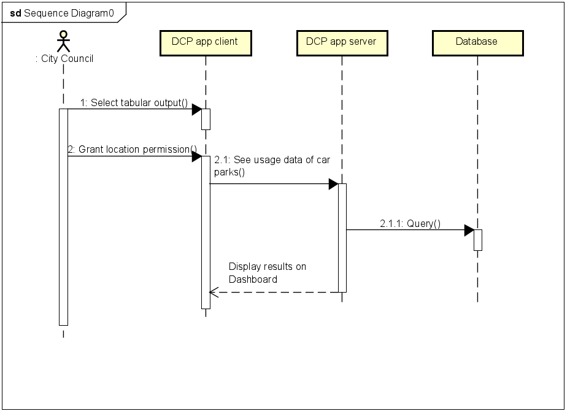
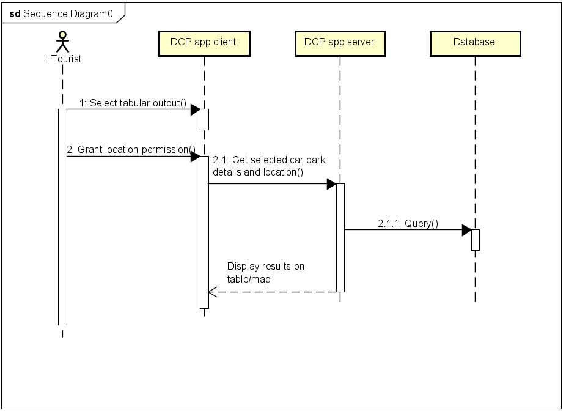
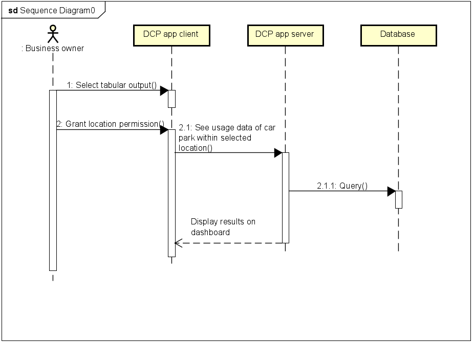

# Design

## Behavioural design

### Car owner interaction

First, car owners must subscribe to the app's location services and terms of service before they can see which car parks are available. When the app receives car park locations from the app server, it makes a query to the database and displays the results on the app's map and table. The car owner can then proceed to and utilise the nearest car park. The car owner can also update the status of the parking space allowing users to be able to communicate through the app therefore creating a community.

### Bristol City Council

On the other hand, the city council will want to be able to manage and monitor parking within the app. They can do so by using a feature on the app that allows the user to see all of the data about the car parks, including usage data, which will allow the council to effectively plan whether to build more car parks or demolish existing ones.

### Tourists

Tourists who accept the app's terms of service and enable location services will be able to utilise the app's capabilities to identify and reserve parking spaces before arriving at their destination. The software will query the database to retrieve relevant data in order to display parking spots within the selected location, allowing users to obtain full descriptions of parking spots and prepare accordingly.

### Business owners

Business owners can use the way the app monitors parking frequency within specific parking places to enhance sales. This is done by assessing the data collected on a visual dashboard within the app and connecting adverts and company hours to improve efficiency.

# Sequence Diagram for Use Case 1

#### Car owner

Description: The designated car park finder app allows the car owner to select a tabular output. The selected tabular output would then be sent to the EV app client. The app would then request the driver to grant permission to access the user location. When the location is accessed, the user would request for the nearest EV charging point locations. The app would then diplay the results on the table/map.

# Sequence Diagram for Use Case 2

#### Bristol City Council

Description: The designated car park finder app allows the Council to select a tabular output. The selected tabular output would then be sent to the EV app client. The app would then request the driver to grant permission to access the user location. When the location is accessed, the user would request for the data usage of the car parks. The app would then diplay the results on the dashboard.

# Sequence Diagram for Use Case 3

#### Tourists

Description: The designated car park finder app allows the car owner to select a tabular output. The selected tabular output would then be sent to the EV app client. The app would then request the driver to grant permission to access the user location. When the location is accessed, the user would request for the car parks within a selected area. The app would then diplay the results on the table/map.

# Sequence Diagram for Use Case 4

#### Business Owners

Description: The designated car park finder app allows the Council to select a tabular output. The selected tabular output would then be sent to the EV app client. The app would then request the driver to grant permission to access the user location. When the location is accessed, the user would request for the data usage of the car parks within a selected area. The app would then diplay the results on the dashboard.

## User Interface design

This image shows a wireframe for the designated parking spot app. It demonstrates three options with the search bar, map, and list by distance.

