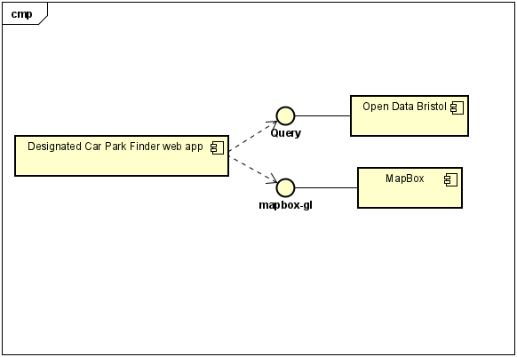

# Implementation

## Introduction

Version V0.1 of the designated car park finder app using 51 rows of data from the "Bristol Open Data" Car Park database (https://opendata.bristol.gov.uk/datasets/55a26718006b47bcade1db6232e82e48_5/explore). The app enables users to be able to track and use car parks more efficiently by giving all the data on car parks that are within a close vacinity or searched for. The app also allows users to pre-book spaces.

 
## Project Structure

tree-cli tree:
```
└── 📁Team-7
    └── 📁Designated Car Park Finder
        └── data usage.htm
        └── DCP.htm
        └── mapcp.htm
        └── sign in.css
        └── sign in.htm
        └── style.css
        └── tablecp.htm
    └── 📁docs
        └── Design.md
        └── 📁diagrams
            └── temp
            └── ComponentDiagram.png
            └── UCSD1.png
            └── UCSD11.png
            └── UCSD2.png
            └── UCSD22.png
            └── UCSD3.png
            └── UCSD33.png
            └── UCSD4.png
            └── UCSD44.png
        └── 📁HTML prototype
            └── data usage.htm
            └── DCP.htm
            └── mapcp.htm
            └── sign in.css
            └── sign in.htm
            └── style.css
            └── tablecp.htm
        └── 📁images
            └── component.png
            └── context.png
            └── deleteme.html
            └── deployment.png
            └── screenshot.png
            └── sequence.png
            └── use-case.png
            └── wireframe.png
        └── Implementation.md
        └── planning.md
        └── Requirements.md
        └── Testing.md
    └── README.md
    └── 📁temp
        └── diagrams
```
PS C:\Users\Nathan\Documents\GitHub\Team-7> npm install -g eslint
node:internal/modules/cjs/loader:1148
  throw err;
  ^

Error: Cannot find module 'C:\Users\Nathan\AppData\Roaming\npm\node_modules\npm\bin\npm-cli.js'
    at Module._resolveFilename (node:internal/modules/cjs/loader:1145:15)
    at Module._load (node:internal/modules/cjs/loader:986:27)
    at Function.executeUserEntryPoint [as runMain] (node:internal/modules/run_main:174:12)
    at node:internal/main/run_main_module:28:49 {
  code: 'MODULE_NOT_FOUND',
  requireStack: []
}

???

## Software Architecture

This Diagram shows how the app communicates with two different services, in this case it would be the OpenData database and the mapbox API .



